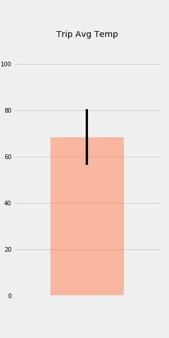

# SQLAlchemy Homework: Surfs Up

This project completes the Surfs Up SQLAlchemy challenge for Honolulu, Hawaii. It uses SQLAlchemy ORM queries, Pandas, Matplotlib, and Flask to explore climate data and provide a small climate API.

## Background

The assignment supports trip planning by analyzing historical Hawaii climate data. The work is split into two required parts: climate analysis in a Jupyter notebook and a Flask API based on the same SQLite database.

## Files

- `climate.ipynb` - Jupyter notebook for climate analysis, data exploration, and optional trip analyses.
- `app.py` - Flask API backed by SQLAlchemy queries.
- `Resources/hawaii.sqlite` - SQLite database used by the notebook and Flask app.
- `Resources/hawaii_measurements.csv` - measurement source data.
- `Resources/hawaii_stations.csv` - station source data.
- `output_data/precipitation plot.png` - exported precipitation chart.
- `output_data/Highest Observation Station Data plot.png` - exported temperature histogram for the most active station.
- `output_data/Average Temperature Comparision.png` - exported June vs. December temperature comparison.
- `output_data/TripTempSummary.png` - exported trip average temperature summary.
- `output_data/Predicted Temperatures for Trip.png` - exported daily normals area plot for trip dates.
- `HW guideline/README.md` - original homework instructions used as the project guideline.

## Step 1: Climate Analysis

`climate.ipynb` connects to `Resources/hawaii.sqlite` with SQLAlchemy `create_engine`, reflects the database with `automap_base()`, and saves references to the `Measurement` and `Station` classes.

The required notebook analysis includes:

- Last 12 months of precipitation data.
- Precipitation summary statistics.
- Total number of weather stations.
- Most active stations by observation count.
- Minimum, maximum, and average temperature for the most active station.
- Last 12 months of temperature observations for the most active station.
- Temperature observation histogram with 12 bins.

## Step 2: Climate App

`app.py` defines the required Flask routes:

- `/` - home route listing available endpoints.
- `/api/v1.0/precipitation` - precipitation results as JSON.
- `/api/v1.0/stations` - station identifiers and names as JSON.
- `/api/v1.0/tobs` - previous-year temperature observations for the most active station.
- `/api/v1.0/<start>` - minimum, average, and maximum temperatures from `start` through the dataset end date.
- `/api/v1.0/<start>/<end>` - minimum, average, and maximum temperatures for the inclusive date range.

Run the API from this folder:

```powershell
python app.py
```

## Optional Analyses

The notebook also includes optional guideline analyses:

- June vs. December temperature comparison.
- Trip temperature range using `calc_temps`.
- Rainfall by weather station for selected trip dates.
- Daily normals for selected trip dates.

## Visualizations

### Precipitation


### Highest Observation Station


### Average Temperature Comparison


### Trip Temperature Summary



### Predicted Temperatures For Trip


## How To Review

1. Open `climate.ipynb` to review the SQLAlchemy climate analysis.
2. Run the notebook from top to bottom to regenerate the output charts.
3. Run `python app.py` to start the Flask API.
4. Visit the listed routes in a browser or API client.

## Notes

- The notebook and app use relative paths, so run them from the `10-sqlalchemy` folder.
- Jupyter checkpoint folders, Python cache files, local environment files, and homework guideline files are ignored by `10-sqlalchemy/.gitignore`.
