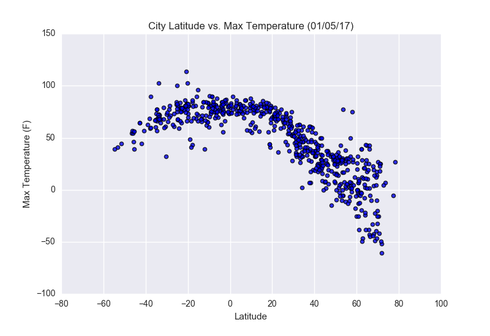
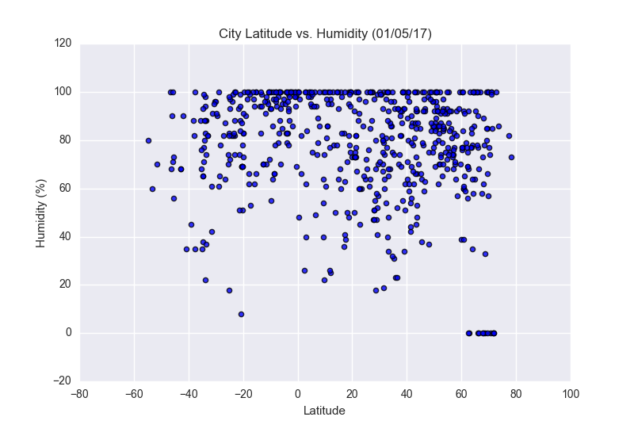
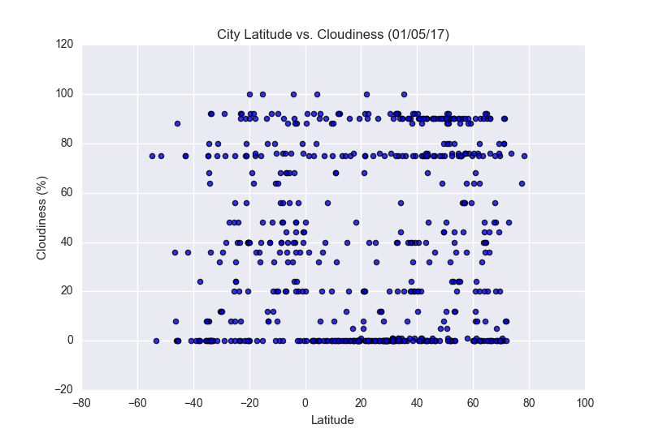
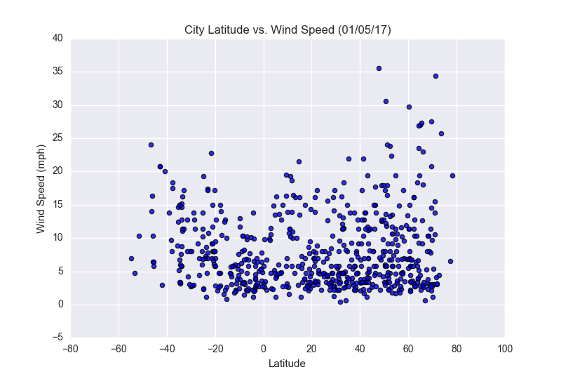

# Web Design Homework: Latitude Dashboard

This folder contains the web design challenge work. The main project is a static Latitude weather visualization dashboard that presents city weather patterns by latitude. A bonus static site is also included for the Pymaceuticals visualizations.

The dashboard follows the homework requirements for a seven-page Bootstrap website: a landing page, four visualization pages, a comparison page, and a data page generated from the source CSV.

## Main Site

The main site is located in `WebVisualizations/` and can be opened from `landing.html`. It uses HTML, CSS, Bootstrap, and local image assets to present the analysis pages.

Pages included:

- `landing.html`: Home page with a project overview and links to each visualization.
- `maxTemp.html`: Latitude vs. maximum temperature analysis.
- `humidity.html`: Latitude vs. humidity analysis.
- `cloudiness.html`: Latitude vs. cloudiness analysis.
- `windspeed.html`: Latitude vs. wind speed analysis.
- `comparison.html`: Side-by-side comparison of all four weather plots.
- `data.html`: Data table generated from the cities dataset.

Project requirements represented in the site:

- Bootstrap navigation appears across the pages.
- The Plots dropdown links to each individual weather visualization.
- The Comparisons page uses a responsive grid layout.
- The Data page presents the CSV-derived data in an HTML table.
- Custom CSS supports the page styling and responsive behavior.

Supporting files:

- `Resources/cities.csv`: Source city weather dataset.
- `Resources/assets/images/Fig1.png` through `Fig4.png`: Plot images used throughout the site.
- `style.css`: Custom styling for the website.
- `data.ipynb`: Notebook used to generate the HTML data table.

## Weather Visualizations

### Latitude vs. Max Temperature

### Latitude vs. Humidity

### Latitude vs. Cloudiness

### Latitude vs. Wind Speed

## Bonus Site

The `bonus/` folder contains a second static website for the Pymaceuticals analysis. It includes a landing page, individual chart pages, comparison page, data pages, styling, and local image assets.

Key pages:

- `bonus/index.html`: Bonus project landing page.
- `bonus/tumor_response.html`: Tumor response to treatment.
- `bonus/metasatic_response.html`: Metastatic response to treatment.
- `bonus/survival.html`: Survival during treatment.
- `bonus/totalchange.html`: Total tumor volume change.
- `bonus/comparison.html`: Comparison page for all bonus plots.
- `bonus/Clinical Trial Data.html`: Clinical trial data table.
- `bonus/Mouse Drug Data.html`: Mouse drug data table.

Bonus visualizations:

## How To Review

Open the HTML files directly in a browser:

1. Open `WebVisualizations/landing.html` for the main weather visualization site.
2. Open `bonus/index.html` for the bonus Pymaceuticals site.

No local server is required because the pages use static HTML, CSS, CSV-derived tables, and local image assets.

For final submission, the homework guideline also calls for publishing the main site with GitHub Pages and submitting both the deployed site link and the repository link.
