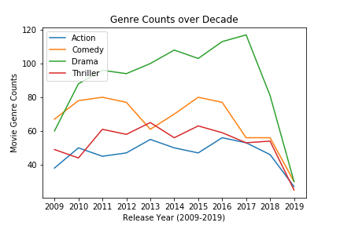
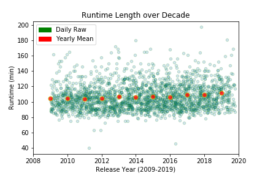
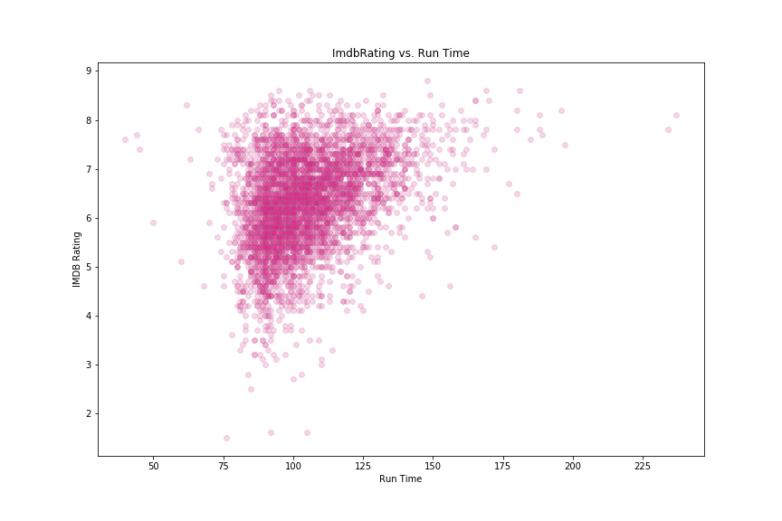
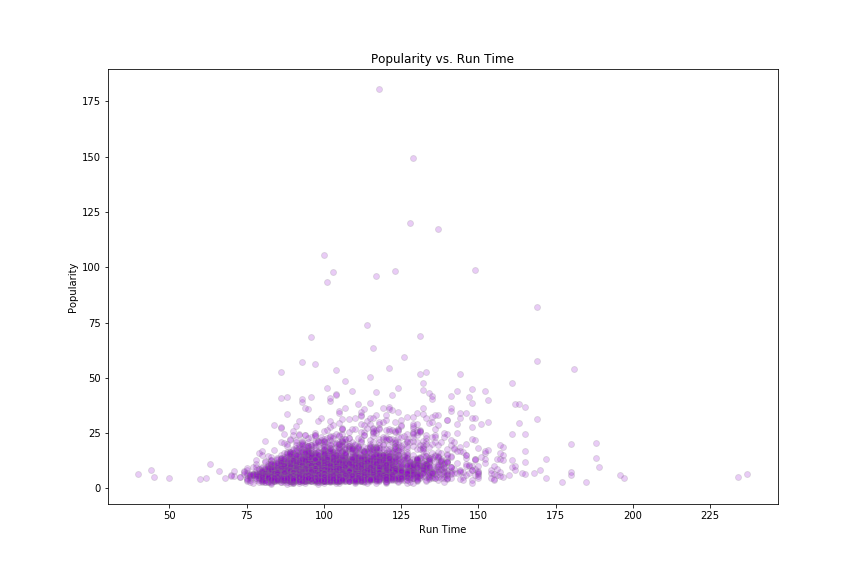
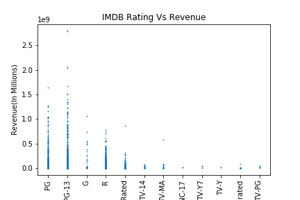
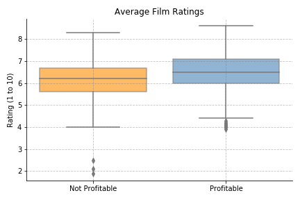

# Project 1: Movie Rating Analysis

This project investigates movie trends using data collected from TMDB and OMDB. The analysis focuses on movies from 2009 through 2019 and explores how genre, runtime, rating, popularity, budget, revenue, and profit relate to movie success.

## Team

- Mohan
- Vicky
- Jack
- Jun

## Project Goal

The goal of this project is to identify patterns that could help guide movie investment decisions. The team used recent movie data to compare performance across genres, ratings, runtimes, and financial outcomes.

Success metrics considered in the analysis:

- Popularity
- Revenue
- Budget
- Profit
- IMDB rating
- Film rating category

## Research Questions

General exploration:

- How are movie releases distributed by genre?
- How does runtime vary across releases?

Popularity and rating:

- What movie length is associated with higher popularity?
- What movie length is associated with higher IMDB ratings?
- Which genres have higher popularity and IMDB ratings?
- Which film rating categories have higher IMDB ratings?

Budget, revenue, and profit:

- Which genres have higher average budget and revenue?
- Which genres produce higher profit or return percentage?
- What is the relationship between budget, revenue, vote average, and film rating?

## Workflow

1. `TMDB_Collection.ipynb`
   - Collected movie records from the TMDB API.
   - Built the base movie dataset with title, budget, genre, popularity, revenue, runtime, vote data, and IMDB IDs.

2. `OMDB_Clooection.ipynb`
   - Collected additional movie details from the OMDB API.
   - Added film rating, IMDB rating, IMDB votes, release data, director, actor, and language fields.

3. `CleanUp.ipynb`
   - Merged TMDB and OMDB data.
   - Removed duplicate or unnecessary columns.
   - Converted unusable zero values in budget and revenue fields to null values.
   - Saved the cleaned dataset for analysis.

4. `dataAnalysis.ipynb`
   - Loaded the cleaned dataset.
   - Created summary tables and charts for the research questions.
   - Exported visualizations to the `output_data/` folder.

## Data Outputs

- `output_data/tmd_api_movie_2019.csv`: TMDB movie data.
- `output_data/omdb_api_movie_2019.csv`: OMDB movie data.
- `output_data/imdb_api_movie_2019.csv`: Combined TMDB data with OMDB/IMDB fields.
- `output_data/cleanup_movie_2019.csv`: Cleaned dataset used for final analysis.

## Visualizations

### Release Trends

### Popularity and Ratings

### Budget, Revenue, and Profit

### Distribution Charts

## Presentation

The project presentation is included as:

- `USC Bootcamp Project 1 (1).pdf`

## How To Review

Open the notebooks in Jupyter Notebook or JupyterLab in this order:

1. `TMDB_Collection.ipynb`
2. `OMDB_Clooection.ipynb`
3. `CleanUp.ipynb`
4. `dataAnalysis.ipynb`

The final cleaned data and generated charts are already available in `output_data/`.

## Notes

- API key files are ignored by `.gitignore` and should be stored locally as `api_keys.py` and `api_keys2.py`.
- The output CSV and PNG files are kept in the project so the analysis can be reviewed without rerunning every API request.
